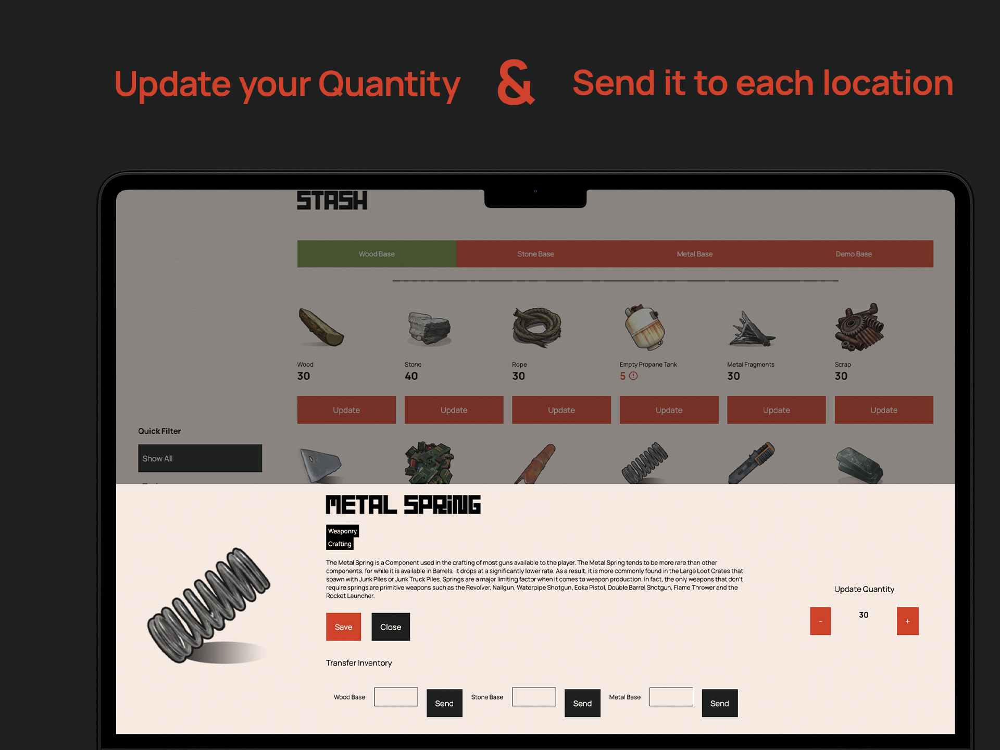
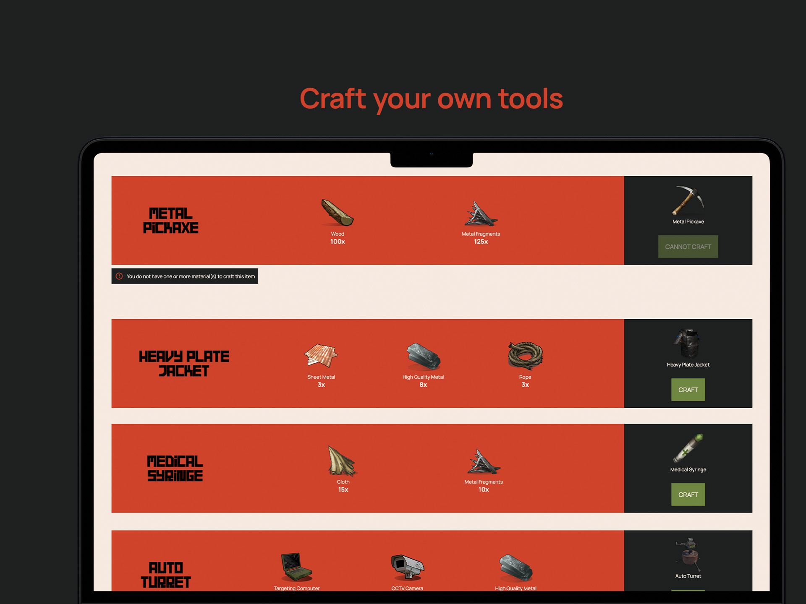
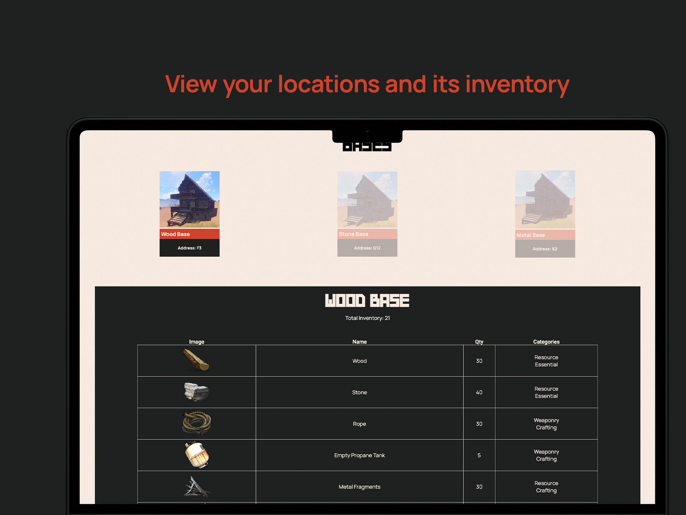
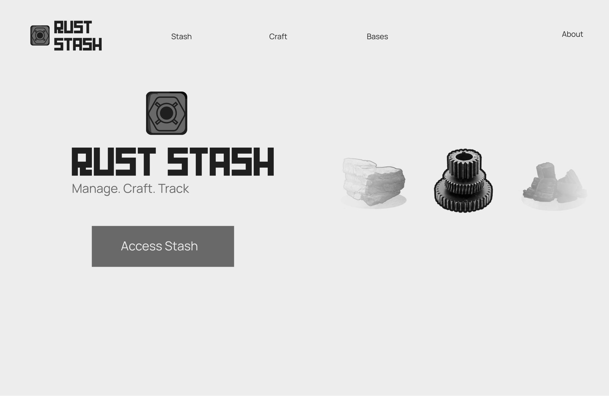
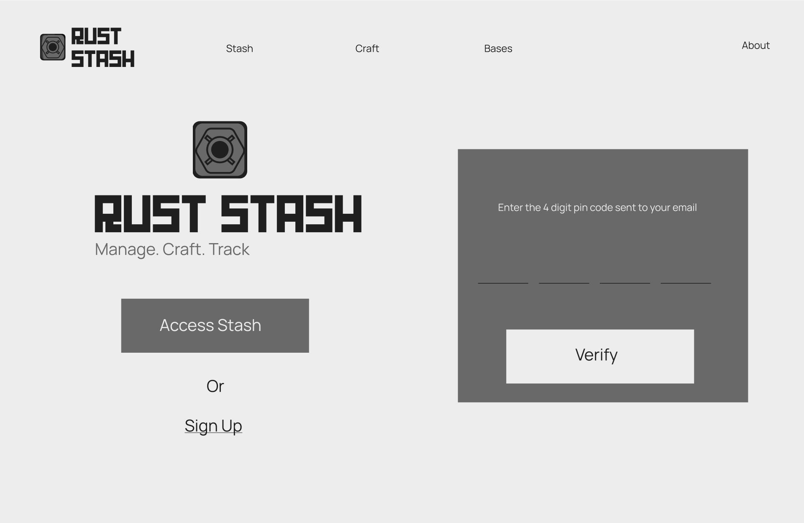
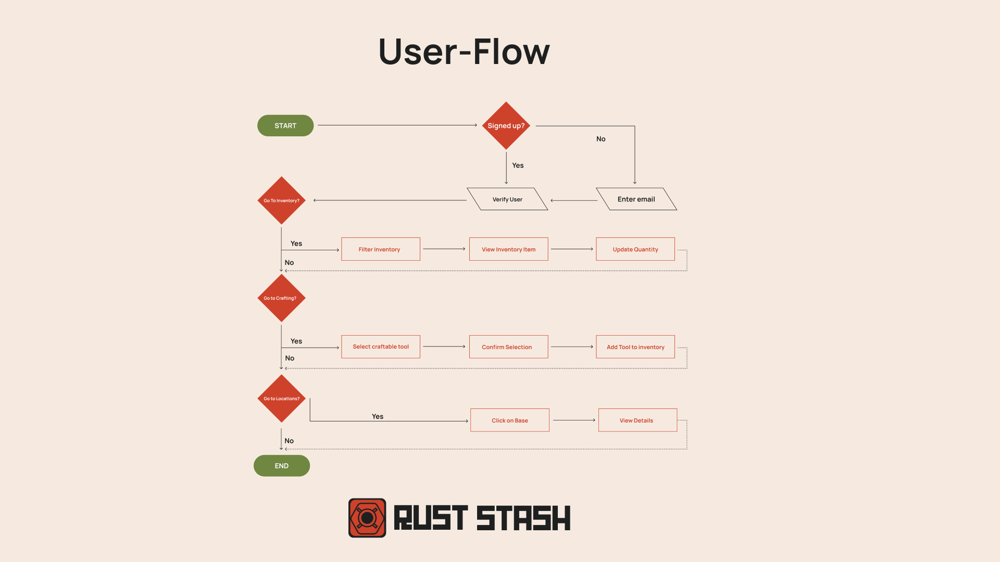
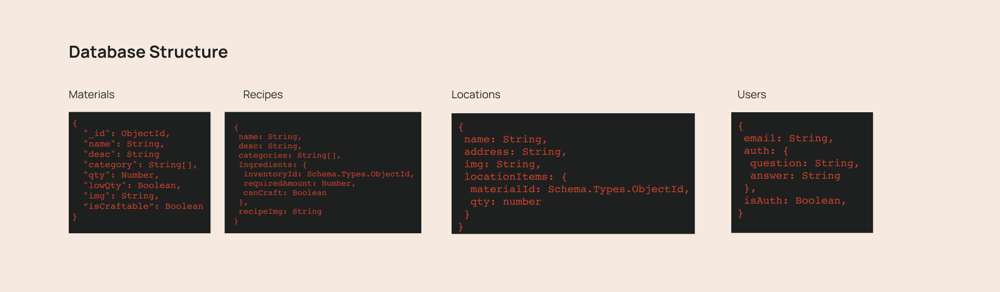
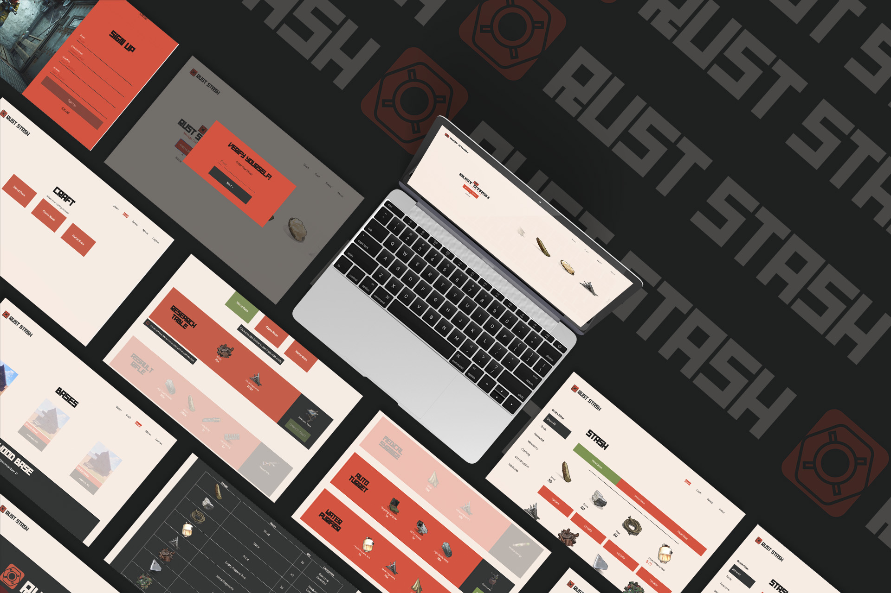

<!-- REPLACE ALL THE [wiaandev] TEXT WITH YOUR GITHUB PROFILE NAME & THE [rust-stash] WITH THE NAME OF YOUR GITHUB PROJECT -->

<!-- Repository Information & Links-->
<br />


[![LinkedIn][linkedin-shield]][linkedin-url]
[![Instagram][instagram-shield]][instagram-url]

<!-- HEADER SECTION -->
<h5 align="center" style="padding:0;margin:0;">Wiaan Duvenhage</h5>
<h5 align="center" style="padding:0;margin:0;">200307</h5>
<h6 align="center">DV300 | Term 1</h6>
</br>
<p align="center">

  <a href="https://github.com/wiaandev/rust-stash">
    
  </a>
  
  <h3 align="center">Rust Stash</h3>

  <p align="center">
    An inventory management system project built with the MEAN Stack.<br>
    [Visit Rust Stash](https://rust-stash.vercel.app)
    
   <br />
   <br />
   <a href="https://youtu.be/Oag-DdqW9jA">View Demo</a>
    ·
    <a href="https://github.com/wiaandev/rust-stash/issues">Report Bug</a>
    ·
    <a href="https://github.com/wiaandev/rust-stash/issues">Request Feature</a>
</p>
<!-- TABLE OF CONTENTS -->

## Table of Contents

- [About the Project](#about-the-project)
  - [Project Description](#project-description)
  - [Built With](#built-with)
- [Getting Started](#getting-started)
  - [Prerequisites](#prerequisites)
  - [How to install](#how-to-install)
- [Features and Functionality](#features-and-functionality)
- [Concept Process](#concept-process)
  - [Ideation](#ideation)
  - [Wireframes](#wireframes)
- [Development Process](#development-process)
  - [Implementation Process](#implementation-process)
    - [Highlights](#highlights)
    - [Challenges](#challenges)
  - [Future Implementation](#peer-reviews)
- [Final Outcome](#final-outcome)
  - [Mockups](#mockups)
  - [Video Demonstration](#video-demonstration)
- [Conclusion](#conclusion)
- [License](#license)
- [Contact](#contact)
- [Acknowledgements](#acknowledgements)

<!--PROJECT DESCRIPTION-->

## About the Project

<!-- header image of project -->


### Project Description

Welcome to Rust Stash! This is an inventory management system where users can manage, track and craft their own inventory. The inventory and its contents are based off of the popular game [Rust](https://rust.facepunch.com/)

### Built With

[&nbsp;&nbsp;&nbsp;&nbsp;&nbsp;&nbsp;&nbsp;&nbsp;](https://www.mongodb.com/cloud/atlas/lp/try4?utm_source=google&utm_campaign=gs_emea_south_africa_search_core_brand_atlas_desktop&utm_term=mongodb&utm_medium=cpc_paid_search&utm_ad=e&utm_ad_campaign_id=12212624560&adgroup=115749711783)
[&nbsp;&nbsp;&nbsp;&nbsp;&nbsp;&nbsp;&nbsp;&nbsp;](https://expressjs.com/)
[&nbsp;&nbsp;&nbsp;&nbsp;&nbsp;&nbsp;&nbsp;&nbsp;](https://angular.io/)
[&nbsp;&nbsp;&nbsp;&nbsp;&nbsp;&nbsp;&nbsp;&nbsp;](https://nodejs.org/en/)

### Deployed With
[&nbsp;&nbsp;&nbsp;&nbsp;&nbsp;&nbsp;&nbsp;&nbsp;](https://vercel.com/)
[&nbsp;&nbsp;&nbsp;&nbsp;&nbsp;&nbsp;&nbsp;&nbsp;](https://render.com/)

<!-- GETTING STARTED -->
<!-- Make sure to add appropriate information about what prerequesite technologies the user would need and also the steps to install your project on their own mashines -->

## Getting Started

The following instructions will get you a copy of the project up and running on your local machine for development and testing purposes.

### Installation

Here are a couple of ways to clone this repo:

1.  GitHub Desktop </br>
    Enter `https://github.com/wiaandev/rust-stash.git` into the URL field and press the `Clone` button.

2.  Clone Repository </br>
    Run the following in the command-line to clone the project:

    ```sh
    git clone https://github.com/wiaandev/rust-stash.git
    ```

        Open `Software` and select `File | Open...` from the menu. Select cloned directory and press `Open` button

3. Ensure that you have Node.js and npm (Node Package Manager) installed on your system. If you don't have them installed, download and install Node.js from the official website [here](https://nodejs.org)

4. Ensure you have Angular installed onto your machine. Run the following command to install the Angular CLI (Command Line Interface):
    ```sh
    npm install -g @angular/cli
    ```

3.  Install Dependencies </br>
    Run the following in the command-line to install all the required dependencies:

    For the front-end

    ```sh
    npm install
    ```

    For the back-end

    ```sh
    cd server
    ```

    ```sh
    npm install --legacy-peer-deps
    ```

<!-- FEATURES AND FUNCTIONALITY-->
<!-- You can add the links to all of your imagery at the bottom of the file as references -->

## Features and Functionality

<!-- note how you can use your gitHub link. Just make a path to your assets folder -->

### Sign Up & Authentication


Users can sign up to access the inventory using their email. Users should also add their security question and security answer, which would be used as a method of authenticating them so that they can access the inventory, locations and crafting pages.

### Logging in


When users click <i>Access Stash</i> they will be prompted with a modal where users will enter their email and security credentials in order to access Rust Stash and its content. Users would not be able to access Rust Stash without being logged in.

### Filtering location stash


On the stash page, users would be able to filter each location and see their respective inventory or stash.

### Updating & Sending Inventory to locations


Users would be prompted with a pop-up modal where they would be able the quantity of their inventory item. On the same pop-up modal, users would be able to send a certain amount of inventory to another location, but not to the same location.

### Craft a tool


By clicking on each block on the crafting page, users can receive a visual indication to determine whether or not they are able to craft a particular tool. User would not be able to craft an item if the craft button is disabled and it shows "cannot craft".

### Location Page


Going to the locations page, a image, name and address of the base will be shown. Clicking on one of the bases or locations, a table will be give to the user, which will showcase the inventory of the base.

<!-- CONCEPT PROCESS -->
<!-- Briefly explain your concept ideation process -->
<!-- here you will add things like wireframing, data structure planning, anything that shows your process. You need to include images-->

## Concept Process

I wanted to make the theme and feel of my project relate extremely close to the theme of Rust. Based on the UI of rust, none of the corners are rounded on their "blocks" and buttons, so this is something I translated into my design and concept process going into this process. I also wanted to keep to a minimalistic approach and clean UI.

### Wireframes






## Development Process

The `Development Process` is the technical implementations and functionality done in the frontend and backend of the application.

## User Flow Diagram

## Database Structure


### Implementation Process

- I followed the component-based development lifecycle by breaking up my web app into numerous components. Using `ng g c componentName` I was able to create my components.

- When it comes to services I made a seperate services folder in my shared folder where all the services in my application will be ran from. I would just add the `@Injectable()` decorator at the top level of my services file, which would make it possible for me to import it where ever necessary.

- I used `*ngFor` and `*ngIf` structural directives which would allow me to manipulate the HTML template based on certain conditions. I used this to show my data from my back-end in conjunction with services.

- I incorporated the MVC design pattern into my project as well. I used models to define my data using Typegoose, which represented how my data is going to look on my MongoDB database. My View was my angular on the front-end, which displays my data that the user sees and interacts with. And then finally my controller, which was my server-side logic that I defined and written in Node.js and Express.js in my `controllers` folder in my server folder. Using this design pattern my code is more maintainable and testable.

- I have also broken up my `index.ts` file into only defining and connecting to my MongoDB database, as well as setting up my middleware that I will be using.

- I have made a routes folder where all my API endpoints will be created, and where I passed my functions from my controllers to my routes files and then exported and imported into my `index.ts` file.

- I have then used my services files to make calls to my back-end and I would then subscribe inside of my `component.ts` file to get my data that I would then populate on my front-end using `*ngFor`.

- I have also set up auth guards which would not allow a user that is not signed in to navigate the pages of Rust Stash by creating a `auth.guard.ts`, which would check if a userId is set in the sessionStorage. If there isn't any, it would route them back to the landing page. I then added a `canActivate: [AuthGuard]` property on the routes that I don't want an unauthorised user to access.


#### Highlights

<!-- stipulated the highlight you experienced with the project -->

- It was a fantastic experience to work with Angular and TypeScript, as it allowed me to enhance my skillset. I must admit that I favor TypeScript over JavaScript without any hesitation.
- Seeing the data being displayed on my front-end was definitely a highlight for me.
- Fixing all the bugs and pain points I encountered along the way was a very big highlight for me as well.
- It was really exciting to witness my application being deployed to a live server.

#### Challenges

<!-- stipulated the challenges you faced with the project and why you think you faced it or how you think you'll solve it (if not solved) -->

- I struggled a lot with figuring out why my data is passing from a normal `<input>` instead of a input component.
- I struggled a lot with figuring out how my data / models are going to look and how they would be populated on my front-end, especially with how each location needs to have their own inventory. 
- Mapping my data to my front-end was also a challenge, because how everything is nested into one another.
- Re-rendering components was a pain point was also a hiccup I encountered, as I did not know enough of Angular to know how to do it properly and correctly.
- I found it difficult as well to do my search and category filter that I wanted to incorporate intially. I still need to dabble more into how Angular handles data before I can do that.

#### Above And Beyond

<!-- TODO Change this! -->

For above and beyond I have deployed this project using Vercel for my front-end deployment software and Render for my back-end deployment software.

### Future Implementation

<!-- TODO Change this! -->

<!-- stipulate functionality and improvements that can be implemented in the future. -->

- I want to add Angular Animations
- Category & Search Filter
- Showcase crafted item in location
- Component re-renders after updates
- Fix crafting display, check materials on all recipes
- Specified error messages
- About Page Mockups + more detailed about page
- I want to make this web app responsive as well

<!-- MOCKUPS -->

## Final Outcome

### Mockups

<!-- TODO Change this -->


<br>

<!-- VIDEO DEMONSTRATION -->

### Video Demonstration

<!-- TODO Change this -->

To see a run through of the application, click below:

[View Demonstration](https://youtu.be/Oag-DdqW9jA)

See the [open issues](https://github.com/wiaandev/rust-stash/issues) for a list of proposed features (and known issues).

<!-- AUTHORS -->

## Authors

- **Wiaan Duvenhage** - [Github](https://github.com/wiaandev)

<!-- LICENSE -->

## License

Distributed under the MIT License. See `LICENSE` for more information.\

<!-- LICENSE -->

## Contact

- **Wiaan Duvenhage** - [wiaanduvenhage.dev@gmail.com](mailto:wiaanduvenhage.dev@gmail.com) - [@wiaan.dev](https://www.instagram.com/wiaan.dev/)
- **Project Link** - https://github.com/wiaandev/rust-stash

<!-- ACKNOWLEDGEMENTS -->

## Acknowledgements


- [Stack Overflow](https://stackoverflow.com/)
- [MongoDB Docs](https://www.mongodb.com/docs/)
- [typegoose Docs](https://typegoose.github.io/typegoose/)
- [Angular Docs](https://angular.io/docs)
- [Figma](https://www.figma.com/)
- [Freepik Mockups](https://www.freepik.com)
- [Rust Fandom](https://rust.fandom.com/wiki/Rust_Wiki)
- [Rust Font](https://www.dafont.com/rust.font)
- [CSS Tricks](https://css-tricks.com/snippets/css/using-font-face-in-css/)
- [Free Frontend](https://freefrontend.com/css-carousels/)
- [CSS Carousel](https://codepen.io/studiojvla/pen/qVbQqW)
- [Google Icons](https://fonts.google.com/icons)
- [Vercel](https://vercel.com/)
- [render](https://render.com/)

[linkedin-shield]: https://img.shields.io/badge/-LinkedIn-black.svg?style=flat-square&logo=linkedin&colorB=555
[linkedin-url]: https://www.linkedin.com/in/wiaan-duvenhage-95118823a/
[instagram-shield]: https://img.shields.io/badge/-Instagram-black.svg?style=flat-square&logo=instagram&colorB=555
[instagram-url]: https://www.instagram.com/wiaan.dev/
