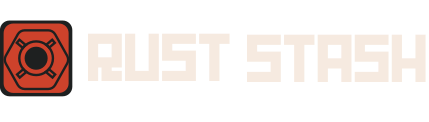

<!-- REPLACE ALL THE [wiaandev] TEXT WITH YOUR GITHUB PROFILE NAME & THE [rust-stash] WITH THE NAME OF YOUR GITHUB PROJECT -->

<!-- Repository Information & Links-->
<br />


[![LinkedIn][linkedin-shield]][linkedin-url]
[![Instagram][instagram-shield]][instagram-url]

<!-- HEADER SECTION -->
<h5 align="center" style="padding:0;margin:0;">Wiaan Duvenhage</h5>
<h5 align="center" style="padding:0;margin:0;">200307</h5>
<h6 align="center">DV300 | Term 1</h6>
</br>
<p align="center">

  <a href="https://github.com/wiaandev/rust-stash">
    
  </a>
  
  <h3 align="center">Rust Stash</h3>

  <p align="center">
    An inventory management system project built with the MEAN Stack.<br>
    
   <br />
   <br />
   <a href="https://youtu.be/Oag-DdqW9jA">View Demo</a>
    ·
    <a href="https://github.com/wiaandev/rust-stash/issues">Report Bug</a>
    ·
    <a href="https://github.com/wiaandev/rust-stash/issues">Request Feature</a>
</p>
<!-- TABLE OF CONTENTS -->

## Table of Contents

- [About the Project](#about-the-project)
  - [Project Description](#project-description)
  - [Built With](#built-with)
- [Getting Started](#getting-started)
  - [Prerequisites](#prerequisites)
  - [How to install](#how-to-install)
- [Features and Functionality](#features-and-functionality)
- [Concept Process](#concept-process)
  - [Ideation](#ideation)
  - [Wireframes](#wireframes)
- [Development Process](#development-process)
  - [Implementation Process](#implementation-process)
    - [Highlights](#highlights)
    - [Challenges](#challenges)
  - [Future Implementation](#peer-reviews)
- [Final Outcome](#final-outcome)
  - [Mockups](#mockups)
  - [Video Demonstration](#video-demonstration)
- [Conclusion](#conclusion)
- [License](#license)
- [Contact](#contact)
- [Acknowledgements](#acknowledgements)

<!--PROJECT DESCRIPTION-->

## About the Project

<!-- header image of project -->


### Project Description

Welcome to Rust Stash! This is an inventory management system where users can manage, track and craft their own inventory. The inventory and its contents are based off of the popular game [Rust](https://rust.facepunch.com/)

### Built With

[&nbsp;&nbsp;&nbsp;&nbsp;&nbsp;&nbsp;&nbsp;&nbsp;](https://www.mongodb.com/cloud/atlas/lp/try4?utm_source=google&utm_campaign=gs_emea_south_africa_search_core_brand_atlas_desktop&utm_term=mongodb&utm_medium=cpc_paid_search&utm_ad=e&utm_ad_campaign_id=12212624560&adgroup=115749711783)
[&nbsp;&nbsp;&nbsp;&nbsp;&nbsp;&nbsp;&nbsp;&nbsp;](https://expressjs.com/)
[&nbsp;&nbsp;&nbsp;&nbsp;&nbsp;&nbsp;&nbsp;&nbsp;](https://angular.io/)
[&nbsp;&nbsp;&nbsp;&nbsp;&nbsp;&nbsp;&nbsp;&nbsp;](https://nodejs.org/en/)

### Deployed With
[&nbsp;&nbsp;&nbsp;&nbsp;&nbsp;&nbsp;&nbsp;&nbsp;](https://vercel.com/)
[&nbsp;&nbsp;&nbsp;&nbsp;&nbsp;&nbsp;&nbsp;&nbsp;](https://render.com/)

<!-- GETTING STARTED -->
<!-- Make sure to add appropriate information about what prerequesite technologies the user would need and also the steps to install your project on their own mashines -->

## Getting Started

The following instructions will get you a copy of the project up and running on your local machine for development and testing purposes.

### Installation

Here are a couple of ways to clone this repo:

1.  GitHub Desktop </br>
    Enter `https://github.com/wiaandev/rust-stash.git` into the URL field and press the `Clone` button.

2.  Clone Repository </br>
    Run the following in the command-line to clone the project:

    ```sh
    git clone https://github.com/wiaandev/rust-stash.git
    ```

        Open `Software` and select `File | Open...` from the menu. Select cloned directory and press `Open` button

3.  Install Dependencies </br>
    Run the following in the command-line to install all the required dependencies:

    For the front-end

    ```sh
    npm install
    ```

    For the back-end

    ```sh
    cd server
    ```

    ```sh
    npm install --legacy-peer-deps
    ```

<!-- FEATURES AND FUNCTIONALITY-->
<!-- You can add the links to all of your imagery at the bottom of the file as references -->

## Features and Functionality

<!-- note how you can use your gitHub link. Just make a path to your assets folder -->

### Sign Up & Authentication


Users can sign up to access the inventory using their email. Users should also add their security question and security answer, which would be used as a method of authenticating them so that they can access the inventory, locations and crafting pages.

### Logging in


When users click <i>Access Stash</i> they will be prompted with a modal where users will enter their email and security credentials in order to access Rust Stash and its content. Users would not be able to access Rust Stash without being logged in.

### Filtering location stash


On the stash page, users would be able to filter each location and see their respective inventory or stash.

### Updating Inventory


Users would be prompted with a pop-up modal where they would be able the quantity of their inventory item.

### Sending Inventory to locations


On the same pop-up modal, users would be able to send a certain amount of inventory to another location, but not to the same location.

### Craft a tool


By clicking on each block on the crafting page, users can receive a visual indication to determine whether or not they are able to craft a particular tool. User would not be able to craft an item if the craft button is disabled and it shows "cannot craft".

### Location Page


Going to the locations page, a image, name and address of the base will be shown. Clicking on one of the bases or locations, a table will be give to the user, which will showcase the inventory of the base.

<!-- CONCEPT PROCESS -->
<!-- Briefly explain your concept ideation process -->
<!-- here you will add things like wireframing, data structure planning, anything that shows your process. You need to include images-->

## Concept Process

It was very evident that blue is something that is very evident when designing dashboards or management portals for medical firms. So it is the route that I decided to go with rust-stash, I tried keeping it clean with different hue's of blue and some accents of a lime green.

### Wireframes


## Development Process

The `Development Process` is the technical implementations and functionality done in the frontend and backend of the application.

### Implementation Process

- I used `npx create-react app` to create this React project. I implemented component-based development instead of classes. By doing this, I will be able to easily inject and eject components and sub-components into my project, making it refactorable and reusable instead of writing up classes I have to do everytime making it tedious and redundant

- I implemented the `date-fns` dependency to manipulate and display the time & date the I wanted to and to create my calendar

- I incorporated `tailwindcss` to create and style my calendar component the way I wanted it to look

- `axios` was implemented so that I can make HTTP requests to the database server so that I can retrieve and push data to it

- I used `PHPMyAdmin` to alter data on the database and used PHP to talk to the backend MySQL database


### Deployment

#### Highlights

<!-- stipulated the highlight you experienced with the project -->

- A highlight of this project was defintely interacting with the database and manipulating data on the database and seeing it being displaye on the application.

#### Challenges

<!-- stipulated the challenges you faced with the project and why you think you faced it or how you think you'll solve it (if not solved) -->

- I struggled to get all my updates and deletes to be implemented.
- I struggled to get all my profile pictures to be updated and rendered on the DOM from the Database.
- debugging the CORS error's for sending data to the Database, especially my Register page's CORS error
- I struggled a lot with debugging the PHP error's
- Front-end was also a bit tricky because I kept following the trend of putting everything in blocks

#### Above And Beyond

<!-- TODO Change this! -->

The aspects I learned outside of this class, is that I implemented tailwindcss to create my calendar, I also incorporated the Date-fns dependency to render my calendar dates.

### Future Implementation

<!-- TODO Change this! -->

<!-- stipulate functionality and improvements that can be implemented in the future. -->

- I want to complete all my update and delete's of the patients and doctor's
- I want to fix my styling for my application
- I want to display the appointments by week
- I want to complete the profile pictures to be rendered and updated

<!-- MOCKUPS -->

## Final Outcome

### Mockups

<!-- TODO Change this -->


<br>

<!-- VIDEO DEMONSTRATION -->

### Video Demonstration

<!-- TODO Change this -->

To see a run through of the application, click below:

[View Demonstration](https://youtu.be/Oag-DdqW9jA)

See the [open issues](https://github.com/wiaandev/rust-stash/issues) for a list of proposed features (and known issues).

<!-- AUTHORS -->

## Authors

- **Wiaan Duvenhage** - [Github](https://github.com/wiaandev)

<!-- LICENSE -->

## License

Distributed under the MIT License. See `LICENSE` for more information.\

<!-- LICENSE -->

## Contact

- **Wiaan Duvenhage** - [wiaanduvenhage.dev@gmail.com](mailto:wiaanduvenhage.dev@gmail.com) - [@wiaan.dev](https://www.instagram.com/wiaan.dev/)
- **Project Link** - https://github.com/wiaandev/rust-stash

<!-- ACKNOWLEDGEMENTS -->

## Acknowledgements

<!-- all resources that you used and Acknowledgements here -->
<!-- TODO Change this -->

- [Stack Overflow](https://stackoverflow.com/)
- [Cooolors](https://coolors.co/)
- [Figma](https://www.figma.com/)
- [My Pinterest Board](https://za.pinterest.com/doubleudeedesigns/budget-app/)
- [(w3schools) SQL SELECT Statement](https://www.w3schools.com/sql/sql_select.asp)
- [Leander van Aarde](https://github.com/LeandervanAarde)
- [Vian Du Plessis](https://github.com/Vian-du-Plessis)

[linkedin-shield]: https://img.shields.io/badge/-LinkedIn-black.svg?style=flat-square&logo=linkedin&colorB=555
[linkedin-url]: https://www.linkedin.com/in/wiaan-duvenhage-95118823a/
[instagram-shield]: https://img.shields.io/badge/-Instagram-black.svg?style=flat-square&logo=instagram&colorB=555
[instagram-url]: https://www.instagram.com/wiaan.dev/
